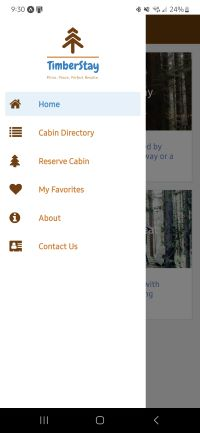
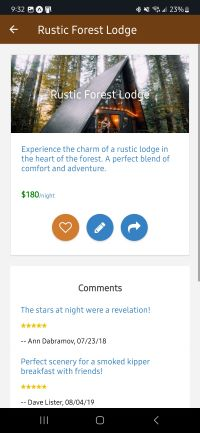

## About this project?

**Welcome to TimberStay – your premier destination for a unique cabin getaway! 🌲✨**

Introducing "TimberStay" a fake cabin rental app. 
Browse through a list of cabins, read customer reviews, and see partner acknowledgments. 
Features include easy rental inquiries, adding to favorites, leaving comments, contact company via email, and sharing cabin details on social networks. 

React Native | React Native Alerts, Gesture, Animations | React Navigation | Node | Expo SDK | Redux | Firebase Storage | Firestore | REST API

## Download the app
🤖 Android app:
https://expo.dev/artifacts/eas/4TdGFDgdbTRa9ene4NDhn6.apk

## About Me?

Feel free to explore my [personal website](https://samjohn87.github.io/) to learn more about me and discover some of my other projects.

## Visuals

